# IaC Multi-Tiered Application Detailed Deployment Guide

### 1: Create The S3 Bucket To Store Your CloudFormation Files
*This will be the location that you use to store the YAML files.*

1. Navigate to the AWS Console. (Ensure you are the region closest to you or where you wish to deploy it)
2. Search for S3 in the search box
3. Select 'Create bucket'.
  - Give your bucket a globally unique name 
  - Block all public access
  - Enable bucket versioning 
  - Leave default encryption as SSE-S3
  - Leave bucket key enabled
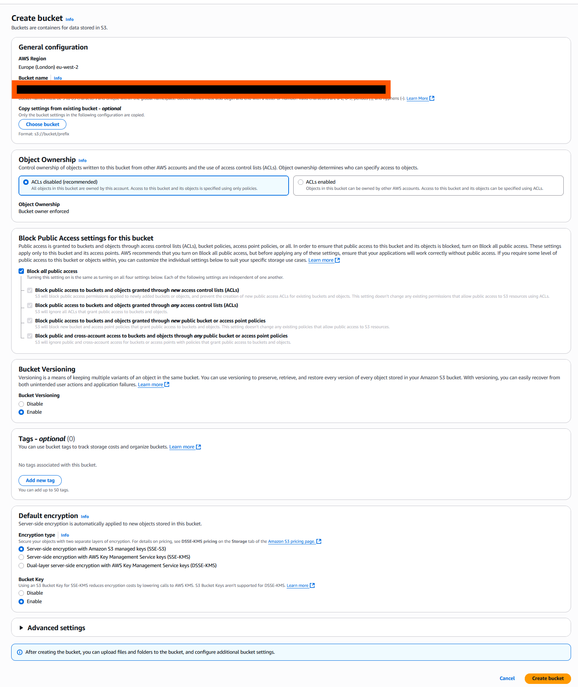

### 2: Create The CloudFormation Service Role
*This will be the role that you use to launch the stack.*

1. Create a YAML template named *cloudformation.yaml*.
2. In the resource section specify all the services required:
  - CloudFormation
  - S3
  - Secrets Manager
  - Systems Manager
  - Iam
  - EC2
  - RDS
  - Elastic Load Balancing
  - Autoscaling
3. Output the service role.

```YAML

AWSTemplateFormatVersion: '2010-09-09'
Description: Multi-Tier Web App CloudFormation Service Role

Resources:
  CloudFormationServiceRole:
    Type: AWS::IAM::Role
    Properties:
      RoleName: !Sub "mtwa-CloudFormationServiceRole"
      AssumeRolePolicyDocument:
        Version: '2012-10-17'
        Statement:
          - Effect: Allow
            Principal:
              Service: cloudformation.amazonaws.com
            Action:
              - 'sts:AssumeRole'
      Path: /
      Policies:
        - PolicyName: CloudFormationStackManagementPolicy
          PolicyDocument:
            Version: '2012-10-17'
            Statement:
              - Effect: Allow
                Action:
                  - cloudformation:*
                  - s3:*
                  - secretsmanager:*
                  - ssm:*
                  - iam:*
                  - ec2:*
                  - rds:*
                  - elasticloadbalancing:*
                  - autoscaling:*
                Resource: '*''

Outputs:
  CloudFormationServiceRoleArn:
    Description: The CloudFormation Service Role for the mtwa
    Value: !GetAtt CloudFormationServiceRole.Arn
    Export:
      Name: !Sub "${AWS::StackName}"

```

### 3: Create The main.yaml File
*This will be the glue that launches your stack as one.*

1. Add the mappings that will be used for the CIDR ranges for the VPC and subnets.
```YAML

Mappings:
  RegionToCidr:
    eu-west-2:
      VpcCidr: 10.16.0.0/16
      PublicSubnet1: 10.16.0.0/20
      PublicSubnet2: 10.16.16.0/20
      PublicSubnet3: 10.16.32.0/20
      PrivateSubnet1: 10.16.48.0/20
      PrivateSubnet2: 10.16.64.0/20
      PrivateSubnet3: 10.16.80.0/20
      
    us-east-1:
      VpcCidr: 10.32.0.0/16
      PublicSubnet1: 10.32.0.0/20
      PublicSubnet2: 10.32.16.0/20
      PublicSubnet3: 10.32.32.0/20
      PrivateSubnet1: 10.32.48.0/20
      PrivateSubnet2: 10.32.64.0/20
      PrivateSubnet3: 10.32.80.0/20
```
2. Create the resources section:
3. Next create a section for each of the stacks that we will create within this nested stack. Ensure to add the mappings as parameters for the VPC.


```YAML
AWSTemplateFormatVersion: '2010-09-09'
Description: Multi-Tier Public Private  stack with CIDR mPrivateings

Mappings:
  RegionToCidr:
    eu-west-2:
      VpcCidr: 10.16.0.0/16
      PublicSubnet1: 10.16.0.0/20
      PublicSubnet2: 10.16.16.0/20
      PublicSubnet3: 10.16.32.0/20
      PrivateSubnet1: 10.16.48.0/20
      PrivateSubnet2: 10.16.64.0/20
      PrivateSubnet3: 10.16.80.0/20
      
    us-east-1:
      VpcCidr: 10.32.0.0/16
      PublicSubnet1: 10.32.0.0/20
      PublicSubnet2: 10.32.16.0/20
      PublicSubnet3: 10.32.32.0/20
      PrivateSubnet1: 10.32.48.0/20
      PrivateSubnet2: 10.32.64.0/20
      PrivateSubnet3: 10.32.80.0/20

Resources:

  SecretsStack:
    Type: AWS::CloudFormation::Stack
    Properties:
      TemplateURL: 
      Parameters:
        StackName: !Ref "AWS::StackName"

  IamStack:
    Type: AWS::CloudFormation::Stack
    Properties:
      TemplateURL:
      Parameters:
        StackName: !Ref "AWS::StackName"
    
  VpcStack:
    Type: AWS::CloudFormation::Stack
    Properties:
      TemplateURL:
      Parameters:
        StackName: !Ref "AWS::StackName"
        VpcCidr: !FindInMap [RegionToCidr, !Ref "AWS::Region", VpcCidr]
        PublicSubnet1: !FindInMap [RegionToCidr, !Ref "AWS::Region", PublicSubnet1]
        PublicSubnet2: !FindInMap [RegionToCidr, !Ref "AWS::Region", PublicSubnet2]
        PrivateSubnet1: !FindInMap [RegionToCidr, !Ref "AWS::Region", PrivateSubnet1]
        PrivateSubnet2: !FindInMap [RegionToCidr, !Ref "AWS::Region", PrivateSubnet2]

  SecurityGroupsStack:
    Type: AWS::CloudFormation::Stack
    Properties:
      TemplateURL:
      Parameters:
        StackName: !Ref "AWS::StackName"


  RDSStack:
    Type: AWS::CloudFormation::Stack
    Properties:
      TemplateURL: 
      Parameters:
        StackName: !Ref "AWS::StackName"
        
  AppLTStack:
    Type: AWS::CloudFormation::Stack
    Properties:
      TemplateURL:
      Parameters:
        StackName: !Ref "AWS::StackName"

  InternalAlbStack:
    Type: AWS::CloudFormation::Stack
    Properties:
        TemplateURL: 
        Parameters:
          StackName: !Ref "AWS::StackName"

  WebLTStack:
    Type: AWS::CloudFormation::Stack
    Properties:
      TemplateURL: 
      Parameters:
        StackName: !Ref "AWS::StackName"

  
  InternalTGStack:
    Type: AWS::CloudFormation::Stack
    Properties:
      TemplateURL: 
      Parameters:
        StackName: !Ref "AWS::StackName"


  AppASGStack:
    Type: AWS::CloudFormation::Stack
    Properties:
      TemplateURL:
      Parameters:
        StackName: !Ref "AWS::StackName"

  ExternalAlbStack:
    Type: AWS::CloudFormation::Stack
    Properties:
      TemplateURL: 
      Parameters:
        StackName: !Ref "AWS::StackName"

  ExternalTGStack:
    Type: AWS::CloudFormation::Stack
    Properties:
      TemplateURL:
      Parameters:
        StackName: !Ref "AWS::StackName"

  WebASGStack:
    Type: AWS::CloudFormation::Stack
    Properties:
      TemplateURL: 
      Parameters:
        StackName: !Ref "AWS::StackName"

```

### 4: Create The Secrets Stack
*This is the stack that will store the parameters and database password.*

1. Import the `StackName` parameter. 
2. Create the resources section.
  - Create the Secrets Manager password.
  - Create the DB name parameter.
  - Create the DB engine parameter.
  - Create the DB port parameter.
3. Output the values
```YAML
AWSTemplateFormatVersion: '2010-09-09'
Description: Foundation stack creates SSM Parameter Store entries for the mtwa database config

Parameters:
  
  StackName:
    Type: String
    Description: Name of the  stack

Resources:

  DBSecrets:
    Type: AWS::SecretsManager::Secret
    Properties:
      Name: !Sub "${StackName}"
      Description: Database master password for the mtwa application
      GenerateSecretString: 
        SecretStringTemplate: !Sub '{"username": "administrator"}'
        GenerateStringKey: "password"
        PasswordLength: 16
        ExcludeCharacters: '\/@" '

  DBNameParameter:
    Type: AWS::SSM::Parameter
    Properties:
      Name: /mtwa/db/name
      Type: String
      Value: mtwadb

  DBEngineParameter:
    Type: AWS::SSM::Parameter
    Properties:
      Name: /mtwa/db/engine
      Type: String
      Value: MySQL
  
  DBPortParameter:
    Type: AWS::SSM::Parameter
    Properties:
      Name: /mtwa/db/port
      Type: String
      Value: 3306

Outputs:

  DBSecretId:
    Description: The password for the database
    Value: !Ref DBSecrets
    Export:
      Name: !Sub "${StackName}-DBSecretId"

  DBNameId:
    Description: The name for the database
    Value: !Ref DBNameParameter
    Export:
      Name: !Sub "${StackName}-DBNameId"

  DBEngineId:
    Description: The engine for the database
    Value: !Ref DBEngineParameter
    Export:
      Name: !Sub "${StackName}-DBEngineId"

  DBPortId:
    Description: The port for the database
    Value: !Ref DBPortParameter
    Export:
      Name: !Sub "${StackName}-DBPortId"
```

### 5: Create the IAM Role Stack
*This stack will create the roles required for the instances.*

1. Import the StackName parameter and the DB secret from the main stack and create a dependency on the secrets and parameters stack.
```YAML
  IamStack:
    Type: AWS::CloudFormation::Stack
    DependsOn:
      - SecretsStack
    Properties:
      TemplateURL: 
      Parameters:
        StackName: !Ref "AWS::StackName"
        DBSecretId: !GetAtt SecretsStack.Outputs.DBSecretId
```
2. Import the parameters from the main stack.
3. Create the IAM role that will be used by the instance profiles.
4. Create the instance profile that will be used by the instances
5. Createe the trust policy that allows the instances to get the DB secret from Secrets Manager.

```YAML
AWSTemplateFormatVersion: '2010-09-09'
Description: Iam Roles for the multi-tier web instance.

Parameters:

  DBSecretId:
    Type: String
    Description: The identifier for the database secret
  
  StackName:
    Type: String
    Description: Name of the  stack
 
Resources: 

  IamInstanceRole:
    Type: AWS::IAM::Role
    Properties:
      RoleName: !Sub "${StackName}-Iam-Role"
      AssumeRolePolicyDocument:
        Version: 2012-10-17
        Statement:
          - Effect: Allow
            Principal:
              Service: ec2.amazonaws.com
            Action:
              - 'sts:AssumeRole'
      Path: /
      ManagedPolicyArns:
       - arn:aws:iam::aws:policy/AmazonSSMManagedInstanceCore
       - arn:aws:iam::aws:policy/CloudWatchAgentServerPolicy

  EC2InstanceProfile:
    Type: AWS::IAM::InstanceProfile
    DependsOn: 
      - IamInstanceRole
    Properties:
      Roles:
        - !Ref IamInstanceRole
      Path: /
      InstanceProfileName: !Sub "${StackName}-InstanceProfile"

  EC2SecretsManagerPolicy:
    Type: AWS::IAM::Policy
    DependsOn:
      - IamInstanceRole
    Properties:
      PolicyName: !Sub "${StackName}-SecretsManager-Policy"
      Roles:
        - !Ref IamInstanceRole
      PolicyDocument:
        Version: "2012-10-17"
        Statement:
          - Effect: Allow
            Action:
              - secretsmanager:GetSecretValue
            Resource:
              - !Ref DBSecretId

Outputs:

  EC2InstanceProfileId:
    Description: The Instance profile for the instances
    Value: !Ref EC2InstanceProfile
```
5. Output the instance profile.

### 6: Create the VPC Stack
*Create the virtual private cloud where all your resources will live*
  
1. Import the mappings for the VPC and the stack name.
```YAML
  VpcStack:
    Type: AWS::CloudFormation::Stack
    Properties:
      TemplateURL:
      Parameters:
        StackName: !Ref "AWS::StackName"
        VpcCidr: !FindInMap [RegionToCidr, !Ref "AWS::Region", VpcCidr]
        PublicSubnet1: !FindInMap [RegionToCidr, !Ref "AWS::Region", PublicSubnet1]
        PublicSubnet2: !FindInMap [RegionToCidr, !Ref "AWS::Region", PublicSubnet2]
        PrivateSubnet1: !FindInMap [RegionToCidr, !Ref "AWS::Region", PrivateSubnet1]
        PrivateSubnet2: !FindInMap [RegionToCidr, !Ref "AWS::Region", PrivateSubnet2]
```
2. Import the parameters from the main stack.
3. Create the resources section for the following:
  - VPC.
  - Internet gateway.
  - Internet gateway attachment.
  - Public subnet 1.
  - Public subnet 2.
  - Private subnet 1.
  - Private subnet 2.
  - NAT gateway elastic IP 1.
  - NAT gateway elastic IP 2.
  - NAT gateway 1.
  - NAT gateway 2.
  - Public route table.
  - Private route table 1.
  - Private route table 2.
  - Public route table association 1.
  - Public route table association 2.
  - Private route table 1 association to private subnet 1.
  - Private route table 2 association to private subnet 2.
  - Create a route to the internet gateway for the public subnet.
  - Create a route in private subnet 1 to NAT gateway 1.
  - Create a route in private subnet 2 to NAT gateway 2.
```YAML

AWSTemplateFormatVersion: '2010-09-09'
Description: Multi-Tier Web App VPC stack

Parameters:

  VpcCidr:
    Type: String
    Description: Mapping for the VPC Cidr range

  PublicSubnet1:
    Type: String
    Description: Mapping for the public Subnet 1 
  
  PublicSubnet2:
    Type: String
    Description: Mapping for the public subnet 2
    
  PrivateSubnet1:
    Type: String
    Description: Mapping for the app private subnet 1
  
  PrivateSubnet2:
    Type: String
    Description: Mapping for the private subnet 2

  StackName:
    Type: String
    Description: Name of the  stack

Resources:

  Vpc:
    Type: AWS::EC2::VPC
    Properties:
      CidrBlock: !Ref VpcCidr
      EnableDnsSupport: true
      EnableDnsHostnames: true
      Tags:
        - Key: Name
          Value: !Sub "${StackName}-vpc"

  InternetGateway:
    Type: AWS::EC2::InternetGateway
    DependsOn: Vpc
    Properties:
      Tags:
        - Key: Name
          Value: !Sub "${StackName}-igw"
  
  AttachInternetGateway:
    Type: AWS::EC2::VPCGatewayAttachment
    DependsOn: InternetGateway
    Properties:
      InternetGatewayId: !Ref InternetGateway
      VpcId: !Ref Vpc
    
  PublicSub1:
    Type: AWS::EC2::Subnet
    Properties:
      VpcId: !Ref Vpc
      AvailabilityZone: !Select [0, !GetAZs ""]
      CidrBlock: !Ref PublicSubnet1
      MapPublicIpOnLaunch: true
      Tags:
        - Key: Name
          Value: !Sub "${StackName}-public-sub1"
  
  PublicSub2:
    Type: AWS::EC2::Subnet
    Properties:
      VpcId: !Ref Vpc
      AvailabilityZone: !Select [1, !GetAZs ""]
      CidrBlock: !Ref PublicSubnet2
      MapPublicIpOnLaunch: true
      Tags:
        - Key: Name
          Value: !Sub "${StackName}-public-sub2"
  
  PrivateSub1:
    Type: AWS::EC2::Subnet
    Properties:
        VpcId: !Ref Vpc
        AvailabilityZone: !Select [0, !GetAZs ""]
        CidrBlock: !Ref PrivateSubnet1
        MapPublicIpOnLaunch: true
        Tags:
        - Key: Name
          Value: !Sub "${StackName}-private-sub1"

  PrivateSub2:
    Type: AWS::EC2::Subnet
    Properties:
        VpcId: !Ref Vpc
        AvailabilityZone: !Select [1, !GetAZs ""]
        CidrBlock: !Ref PrivateSubnet2
        MapPublicIpOnLaunch: false
        Tags:
        - Key: Name
          Value: !Sub "${StackName}-private-sub2"

  NatGatewayElasticIP1:
    Type: AWS::EC2::EIP
    Properties:
      Domain: vpc
      Tags:
        - Key: Name
          Value: !Sub "${StackName}-nat-eip-1" 
  
  NatGatewayElasticIP2:
    Type: AWS::EC2::EIP
    Properties:
      Domain: vpc
      Tags:
        - Key: Name
          Value: !Sub "${StackName}-nat-eip-2" 
  
  NatGateway1:
    Type: AWS::EC2::NatGateway
    DependsOn: PublicSub1
    Properties:
      AllocationId: !GetAtt NatGatewayElasticIP1.AllocationId
      SubnetId: !Ref PublicSub1
      Tags:
        - Key: Name
          Value: !Sub "${StackName}-natgateway-1"
  
  NatGateway2:
    Type: AWS::EC2::NatGateway
    DependsOn: PublicSub2
    Properties:
      AllocationId: !GetAtt NatGatewayElasticIP2.AllocationId
      SubnetId: !Ref PublicSub2
      Tags:
        - Key: Name
          Value: !Sub "${StackName}-natgateway-2"
  
  PublicRouteTable:
    Type: AWS::EC2::RouteTable
    Properties: 
      VpcId: !Ref Vpc
      Tags:
        - Key: Name
          Value: !Sub "${StackName}-pubic-rt-1"
  
  PrivateRouteTable1:
    Type: AWS::EC2::RouteTable
    Properties:
      VpcId: !Ref Vpc
      Tags:
        - Key: Name
          Value: !Sub "${StackName}-private-rt-1"
  
  PrivateRouteTable2:
    Type: AWS::EC2::RouteTable
    Properties:
      VpcId: !Ref Vpc
      Tags:
        - Key: Name
          Value: !Sub "${StackName}-private-rt-2"

  PublicRtAssociation1:
    Type: AWS::EC2::SubnetRouteTableAssociation
    Properties:
      SubnetId: !Ref PublicSub1
      RouteTableId: !Ref PublicRouteTable
  
  PublicRtAssociation2:
    Type: AWS::EC2::SubnetRouteTableAssociation
    DependsOn: PublicRtAssociation1
    Properties:
      SubnetId: !Ref PublicSub2
      RouteTableId: !Ref PublicRouteTable

  PrivateRt1Associations:
    Type: AWS::EC2::SubnetRouteTableAssociation
    Properties:
      SubnetId: !Ref PrivateSub1
      RouteTableId: !Ref PrivateRouteTable1
  
  PrivateRt2Associations:
    Type: AWS::EC2::SubnetRouteTableAssociation
    Properties:
      SubnetId: !Ref PrivateSub2
      RouteTableId: !Ref PrivateRouteTable2

  PublicRouteExternal:
    Type: AWS::EC2::Route
    DependsOn: AttachInternetGateway
    Properties:
      RouteTableId: !Ref PublicRouteTable
      DestinationCidrBlock: 0.0.0.0/0
      GatewayId: !Ref InternetGateway

  Private1RouteExternal:
    Type: AWS::EC2::Route
    DependsOn: AttachInternetGateway
    Properties:
      RouteTableId: !Ref PrivateRouteTable1
      DestinationCidrBlock: 0.0.0.0/0
      NatGatewayId: !Ref NatGateway1

  Private2RouteExternal:
    Type: AWS::EC2::Route
    DependsOn: AttachInternetGateway
    Properties:
      RouteTableId: !Ref PrivateRouteTable2
      DestinationCidrBlock: 0.0.0.0/0
      NatGatewayId: !Ref NatGateway2
  
Outputs:

  VpcId:
    Description: The VPC for the multi-tiered web application
    Value: !Ref Vpc
    Export:
      Name: !Sub "${StackName}-VpcId"

  PublicSubnet1Id:
    Description: The first public subnet for the multi-tiered web application
    Value: !Ref PublicSub1
    Export:
      Name: !Sub "${StackName}-Public-SubId"
  
  PublicSubnet2Id:
    Description: The second public subnet for the multi-tier web application
    Value: !Ref PublicSub2
    Export:
      Name: !Sub "${StackName}-Public-Sub2Id"

  PrivateSubnet1Id:
    Description: The private subnet for the multi-tiered web application
    Value: !Ref PrivateSub1
    Export:
      Name: !Sub "${StackName}-Private-Sub1Id"
  
  PrivateSubnet2Id:
    Description: The private subnet for the multi-tiered web application
    Value: !Ref PrivateSub2
    Export:
      Name: !Sub "${StackName}-Private-Sub2Id"
  
  PublicRouteTableId:
    Description: The public route table for the multi-tiered web application
    Value: !Ref PublicRouteTable
    Export:
      Name: !Sub "${StackName}-Pubic-RTId"
  
  PrivateRouteTable1Id:
    Description: The private route table for the multi-tier web application
    Value: !Ref PrivateRouteTable1
    Export:
      Name: !Sub "${StackName}-Private-RT1Id"

  PrivateRouteTable2Id:
    Description: The private route table for the multi-tier web application
    Value: !Ref PrivateRouteTable2
    Export:
      Name: !Sub "${StackName}-Private-RT2Id"
```
4. Output the VPC, public subnets, private subnets, public route table and private route tables.

### 7: Create The Security Group Stacks
*This stack will house all your security groups.*

1. Import the VPC stack parameters, the stack name parameter and create a dependency on the VPC stack.
```YAML
  SecurityGroupsStack:
    Type: AWS::CloudFormation::Stack
    DependsOn: VpcStack
    Properties:
      TemplateURL:
      Parameters:
        StackName: !Ref "AWS::StackName"
        VpcId: !GetAtt VpcStack.Outputs.VpcId
```
2. Import the parameters from the main stack.
3. Create the following resources:
  - External ALB security group.
  - Web application EC2 instance security group.
  - Internal ALB security group.
  - Application tier EC2 instance security group. 
  - Create the RDS security group.
  
```YAML
AWSTemplateFormatVersion: '2010-09-09'
Description: Creating the security group for the multi-tier web app

Parameters:

  VpcId:
    Type: String
    Description: The VPC ID
  
  StackName:
    Type: String
    Description: Name of the stack

Resources:

  Ec2ExternalAlbSg:
    Type: AWS::EC2::SecurityGroup
    Properties:
      GroupDescription: Security group that controls albs
      VpcId: !Ref VpcId
      SecurityGroupIngress: 
        - IpProtocol: tcp
          FromPort: 80
          ToPort: 80
          CidrIp: 0.0.0.0/0
        - IpProtocol: tcp
          FromPort: 443
          ToPort: 443
          CidrIp: 0.0.0.0/0
      Tags:
        - Key: Name
          Value: !Sub "{StackName}-external-alb-sg"
  
  Ec2WebSg:
    Type: AWS::EC2::SecurityGroup
    Properties:
      GroupDescription: Security group that controls web instances
      VpcId: !Ref VpcId
      SecurityGroupIngress: 
        - IpProtocol: tcp
          FromPort: 80
          ToPort: 80
          SourceSecurityGroupId: !Ref Ec2ExternalAlbSg
      Tags:
        - Key: Name
          Value: !Sub "{StackName}-web-sg"
    
  Ec2InternalAlbSg:
    Type: AWS::EC2::SecurityGroup
    Properties:
      GroupDescription: Security group that controls web instances
      VpcId: !Ref VpcId
      SecurityGroupIngress: 
        - IpProtocol: tcp
          FromPort: 8080
          ToPort: 8080
          SourceSecurityGroupId: !Ref Ec2WebSg
      Tags:
        - Key: Name
          Value: !Sub "{StackName}-internal-alb-sg"
          
  Ec2AppSg:
    Type: AWS::EC2::SecurityGroup
    Properties:
      GroupDescription: Security group that controls app instances
      VpcId: !Ref VpcId
      SecurityGroupIngress: 
        - IpProtocol: tcp
          FromPort: 8080
          ToPort: 8080
          SourceSecurityGroupId: !Ref Ec2InternalAlbSg
      Tags:
        - Key: Name
          Value: !Sub "{StackName}-app-sg"
  
  RdsSg:
    Type: AWS::EC2::SecurityGroup
    DependsOn: Ec2AppSg
    Properties:
      GroupDescription: Security group that controls the database traffic
      VpcId: !Ref VpcId
      SecurityGroupIngress:
        - IpProtocol: tcp
          FromPort: 3306
          ToPort: 3306
          SourceSecurityGroupId: !Ref Ec2AppSg
      Tags:
        - Key: Name
          Value: !Sub "{StackName}-rds-sg"


Outputs: 
  Ec2ExternalAlbSgId:
    Description: The security group for the multi-tier app alb
    Value: !Ref Ec2ExternalAlbSg
    Export:
      Name: !Sub "${StackName}ExtAlbSgId"

  Ec2WebSgId:
    Description: The security group for the multi-tier app web instances
    Value: !Ref Ec2WebSg
    Export:
      Name: !Sub "${StackName}Ec2WebSgId"
  
  Ec2InternalAlbSgId:
    Description: The security group for the multi-tier app alb
    Value: !Ref Ec2InternalAlbSg
    Export:
      Name: !Sub "${StackName}IntAlbSgId"

  Ec2AppSgId:
    Description: The security group for the multi-tier app instances
    Value: !Ref Ec2AppSg
    Export:
      Name: !Sub "${StackName}Ec2AppSgId"
  
  RdsSgId:
    Description: The security group for the multi-tier app rds 
    Value: !Ref RdsSg
    Export:
      Name: !Sub "${StackName}RdsSgId"
```

### 8: Create The Database Stack
*This is the stack that will hold your database configuration*

1. Import the stack name, VPC, security group and secrets parameters. Create a dependency for both the VPC stack and security group stack. 
```YAML
 RDSStack:
    Type: AWS::CloudFormation::Stack
    DependsOn: 
      - SecurityGroupsStack
      - SecretsStack
      - VpcStack
    Properties:
      TemplateURL:
      Parameters:
        StackName: !Ref "AWS::StackName"
        VpcId: !GetAtt VpcStack.Outputs.VpcId
        PrivateSubnet1Id: !GetAtt VpcStack.Outputs.PrivateSubnet1Id
        PrivateSubnet2Id: !GetAtt VpcStack.Outputs.PrivateSubnet2Id
        RdsSgId: !GetAtt SecurityGroupsStack.Outputs.RdsSgId 
        DBSecretId: !GetAtt SecretsStack.Outputs.DBSecretId
        DBNameId: !GetAtt SecretsStack.Outputs.DBNameId
        DBEngineId: !GetAtt SecretsStack.Outputs.DBEngineId
        DBPortId: !GetAtt SecretsStack.Outputs.DBPortId
```
2. Import the stack name, VPC. security group and secrets parameters. 
3. In the resources create:
  - The database subnet group.
  - The database instance.
```YAML
AWSTemplateFormatVersion: '2010-09-09'
Description: Multi-Tier Web App RDS Stack

Parameters:

  VpcId:
    Type: String
    Description: The identifier for the VPC
  
  PrivateSubnet1Id:
    Type: String
    Description: Private subnet 1 DBSecretId
  
  PrivateSubnet2Id:
    Type: String
    Description: Private subnet 2 identifier

  RdsSgId:
    Type: String
    Description: The identifier for the RDS security group
  
  DBSecretId:
    Type: String
    Description: The secret for the databse
  
  DBNameId:
    Type: String
    Description: The name of the database

  DBEngineId:
    Type: String
    Description: The database engine.

  DBPortId:
    Type: String
    Description: The database port

  StackName:
    Type: String
    Description: Name of the  stack

Resources:

  SubnetGroup:
    Type: AWS::RDS::DBSubnetGroup
    Properties:
      DBSubnetGroupName: !Sub "${StackName}-dbsubnetgroup"
      DBSubnetGroupDescription: Database subnet group for RDS
      SubnetIds:
        - !Ref PrivateSubnet1Id
        - !Ref PrivateSubnet2Id
      Tags:
        - Key: Name
          Value: !Sub "${StackName}-dbsubgroup"

  AppDb1:
    Type: AWS::RDS::DBInstance
    DependsOn: SubnetGroup
    Properties:
      DBInstanceIdentifier: !Sub "${StackName}-DB"
      DBInstanceClass: db.m5.large
      AllocatedStorage: "400"
      StorageType: gp2
      MultiAZ: true
      StorageEncrypted: true
      Engine: !Sub '{{resolve:ssm:${DBEngineId}}}'        
      MasterUsername: !Sub '{{resolve:secretsmanager:${DBSecretId}:SecretString:username}}'
      MasterUserPassword: !Sub '{{resolve:secretsmanager:${DBSecretId}:SecretString:password}}'
      DBName: !Sub '{{resolve:ssm:${DBNameId}}}'
      Port: !Sub '{{resolve:ssm:{DBPortId}}}'
      DBSubnetGroupName: !Ref SubnetGroup
      VPCSecurityGroups:
        - !Ref RdsSgId
      PubliclyAccessible: false
      DeletionProtection: false
      NetworkType: "IPV4"
      Tags:
        - Key: Name
          Value: !Sub "${StackName}-DB"


Outputs:
  
  DatabaseId:
    Description: The ID for the database
    Value: !Ref AppDb1
    Export:
      Name: !Sub "${StackName}-DbId"
  
  DatabaseEndpointId:
    Description: The endpoint for the database instance
    Value: !GetAtt AppDb1.Endpoint.Address
    Export:
      Name: !Sub "${StackName}-DbEndpointId"

```
4. Export the database and database endpoint address.

### 9: Create The App Launch Template Stack
*This is the stack that will contain the app tier launch template*

1. Import the stack name, security group, secrets, IAM and database parameters. Create dependencies on the security group, IAM, RDS and secret stack. 
```YAML
  AppLTStack:
    Type: AWS::CloudFormation::Stack
    DependsOn: 
      - SecretsStack
      - SecurityGroupsStack
      - IamStack
      - RDSStack
    Properties:
      TemplateURL:
      Parameters:
        StackName: !Ref "AWS::StackName"
        Ec2AppSgId: !GetAtt SecurityGroupsStack.Outputs.Ec2AppSgId 
        DBSecretId: !GetAtt SecretsStack.Outputs.DBSecretId 
        EC2InstanceProfileId: !GetAtt IamStack.Outputs.EC2InstanceProfileId  
        DatabaseEndpointId: !GetAtt RDSStack.Outputs.DatabaseEndpointId     
```
2. Import the stack name, security group, secrets, IAM and database parameters.
3. Create the app tier launch template:
```YAML
AWSTemplateFormatVersion: '2010-09-09'
Description: App Tier EC2 Launch Template

Parameters:

  Ec2AppSgId:
    Type: String
    Description: The security group for the app tier instance

  DBSecretId:
    Type: String
    Description: The name of the Secrets Manager secret for the database user.
  
  DatabaseEndpointId:
    Type: String
    Description: The hostname for the database

  EC2InstanceProfileId:
    Type: String 
    Description: The instance profile ID

  StackName:
    Type: String
    Description: Name of the  stack

Resources:
  AppTierLaunchTemplate:
    Type: AWS::EC2::LaunchTemplate
    Properties:
      LaunchTemplateName: !Sub "${StackName}-AppTier"
      LaunchTemplateData:
        ImageId: '{{resolve:ssm:/aws/service/ami-amazon-linux-latest/amzn2-ami-hvm-x86_64-gp2}}'
        InstanceType: t2.micro
        SecurityGroupIds:
          - !Ref Ec2AppSgId
        IamInstanceProfile:
          Name: !Ref EC2InstanceProfileId
        UserData:
          Fn::Base64: !Sub |
            #!/bin/bash
            set -xe
            rpm -Uvh https://dev.mysql.com/get/mysql80-community-release-el7-3.noarch.rpm
            rpm --import https://repo.mysql.com/RPM-GPG-KEY-mysql-2023
            yum install -y mysql-community-client jq mysql git python3-pip
            python3 -m pip install --upgrade pip
            pip3 install Flask PyMySQL gunicorn cryptography


            mkdir -p /home/ec2-user/app

            SECRET_JSON=$(aws secretsmanager get-secret-value \
              --secret-id ${DBSecretId} \
              --query SecretString \
              --output text \
              --region ${AWS::Region})

            DB_USER=$(echo $SECRET_JSON | jq -r .username)
            DB_PASSWORD=$(echo $SECRET_JSON | jq -r .password)

            DB_NAME=$(aws ssm get-parameter \
              --name /mtwa/db/name \
              --with-decryption \
              --query Parameter.Value \
              --output text \
              --region ${AWS::Region})

            cat <<'EOF' > /home/ec2-user/app/app.py
            from flask import Flask
            import pymysql, os

            app = Flask(__name__)
            DB_HOST = os.environ['DB_HOST']
            DB_USER = os.environ['DB_USER']
            DB_PASSWORD = os.environ['DB_PASSWORD']
            DB_NAME = os.environ['DB_NAME']

            @app.route('/')
            def hello_world():
                try:
                    conn = pymysql.connect(
                        host=DB_HOST,
                        user=DB_USER,
                        password=DB_PASSWORD,
                        database=DB_NAME,
                        connect_timeout=5
                    )
                    cursor = conn.cursor()
                    cursor.execute("SELECT VERSION()")
                    db_version = cursor.fetchone()[0]
                    cursor.close()
                    conn.close()
                    return f"<h1>App Tier - Connected to MySQL: {db_version}</h1>"
                except Exception as e:
                    return f"<h1>Database connection failed: {e}</h1>", 500

            if __name__ == '__main__':
                app.run(host='0.0.0.0', port=8080)
            EOF
            
            cat <<EOF > /etc/systemd/system/flaskapp.service
            [Unit]
            Description=Gunicorn instance to serve my Flask app
            After=network.target

            [Service]
            User=ec2-user
            Group=ec2-user
            WorkingDirectory=/home/ec2-user/app
            ExecStart=/usr/local/bin/gunicorn --workers 4 --bind 0.0.0.0:8080 app:app
            Restart=always

            Environment="DB_HOST=${DatabaseEndpointId}"
            Environment="DB_USER=$DB_USER"
            Environment="DB_PASSWORD=$DB_PASSWORD"
            Environment="DB_NAME=$DB_NAME"
            
            [Install]
            WantedBy=multi-user.target
            EOF

            systemctl daemon-reload
            systemctl start flaskapp
            systemctl enable flaskapp
          
Outputs: 

  AppTierLaunchTemplateId:
    Description: The launch template for the app tier
    Value: !Ref AppTierLaunchTemplate
    Export:
      Name: !Sub "${StackName}-lt-apptierId"
  
  AppTierLaunchTemplateVersion:
    Description: The version of the web tier launch template
    Value: !GetAtt AppTierLaunchTemplate.LatestVersionNumber
    Export:
      Name: !Sub "${StackName}-lt-apptier-version"
```
4. Output the launch template and template version.

### 10: Create The Internal ALB Stack
*This is the stack that will hold the internal load balancer*

1. Import the stack name and VPC parameters. Create a dependency on the VPC stack.
```YAML
  InternalAlbStack:
    Type: AWS::CloudFormation::Stack
    DependsOn: 
      - VpcStack
    Properties:
        TemplateURL:
        Parameters:
          StackName: !Ref "AWS::StackName"
          PrivateSubnet1Id: !GetAtt VpcStack.Outputs.PrivateSubnet1Id
          PrivateSubnet2Id: !GetAtt VpcStack.Outputs.PrivateSubnet2Id
          Ec2InternalAlbSgId: !GetAtt SecurityGroupsStack.Outputs.Ec2InternalAlbSgId
```
2. Import the stack name and VPC parameters.
3. Create the ALB resource.
```YAML

AWSTemplateFormatVersion: '2010-09-09'
Description: Internal Application Load Balancer for App Tier

Parameters:
  PrivateSubnet1Id:
    Type: String
    Description: The ID for the first private subnet

  PrivateSubnet2Id:
    Type: String
    Description: The ID for the second private subnet

  Ec2InternalAlbSgId:
    Type: String
    Description: The ID for the internal ALB security group

  StackName:
    Type: String
    Description: Name of the  stack


Resources:
  InternalApplicationLoadBalancer:
    Type: AWS::ElasticLoadBalancingV2::LoadBalancer
    Properties:
      Name: !Sub "${StackName}-Internal-alb"
      Type: application
      Scheme: internal
      Subnets:
        - !Ref PrivateSubnet1Id
        - !Ref PrivateSubnet2Id
      SecurityGroups:
        - !Ref Ec2InternalAlbSgId
      Tags:
        - Key: Name
          Value: !Sub "${StackName}-internal-alb"

Outputs:

  InternalAlbDNS:
    Value: !GetAtt InternalApplicationLoadBalancer.DNSName
    Export:
      Name: !Sub "${StackName}-AlbDNS"

  InternalAlbId:
    Value: !Ref InternalApplicationLoadBalancer
    Export:
      Name: !Sub "${StackName}-AlbId"
```
4. Export the ALB DNS and the ALB.

### 11: Create The Web Tier Launch Template Stack
*This is the stack that will contain the web instance launch template*

1. Import the stack name, security group, IAM and internal ALB parameters. Create a dependency for the security group, IAM and internal ALB stacks.
```YAML
  WebLTStack:
    Type: AWS::CloudFormation::Stack
    DependsOn: 
      - SecurityGroupsStack
      - IamStack
      - InternalAlbStack
    Properties:
      TemplateURL: https://multi-tier-web-app-tjt.s3.eu-west-2.amazonaws.com/launch-templates/web-tier-launch-template.yaml
      Parameters:
        StackName: !Ref "AWS::StackName"
        Ec2WebSgId: !GetAtt SecurityGroupsStack.Outputs.Ec2WebSgId
        EC2InstanceProfileId: !GetAtt IamStack.Outputs.EC2InstanceProfileId   
        InternalAlbDNS: !GetAtt InternalAlbStack.Outputs.InternalAlbDNS    
```
2. Import the stack name, security group, IAM and ALB parameters frorm the main template.
3. Create the web tier launch template.

```YAML
AWSTemplateFormatVersion: '2010-09-09'
Description: Web Tier EC2 Launch Template

Parameters:

  Ec2WebSgId:
    Type: String
    Description: The web security group

  InternalAlbDNS:
    Type: String
    Description: The DNS for the internal ALB

  EC2InstanceProfileId:
    Type: String
    Description: The instance profile ID

  StackName:
    Type: String
    Description: Name of the  stack

Resources:
  WebTierLaunchTemplate:
    Type: AWS::EC2::LaunchTemplate
    Properties:
      LaunchTemplateName: !Sub "${StackName}-WebTier"
      LaunchTemplateData:
        ImageId: '{{resolve:ssm:/aws/service/ami-amazon-linux-latest/amzn2-ami-hvm-x86_64-gp2}}'
        InstanceType: t2.micro
        SecurityGroupIds:
          - !Ref Ec2WebSgId
        IamInstanceProfile:
          Name: !Ref EC2InstanceProfileId
        UserData:
          Fn::Base64: !Sub |
            #!/bin/bash
            set -xe
            yum install httpd mod_ssl -y
            yum install mod_proxy_html -y
          
            systemctl start httpd
            systemctl enable httpd

            cat <<'EOF' > /etc/httpd/conf.d/my-app.conf
            <VirtualHost *:80>
              ServerAdmin webmaster@localhost
              DocumentRoot /var/www/html
              ErrorLog /var/log/httpd/error_log
              CustomLog /var/log/httpd/access_log combined

              ProxyPreserveHost On
              ProxyRequests Off

              ProxyPass / http://${InternalAlbDNS}:8080/
              ProxyPassReverse / http://${InternalAlbDNS}:8080/
            </VirtualHost>
            EOF

            systemctl restart httpd

Outputs: 

  WebTierLaunchTemplateId:
    Description: The launch template for the web tier
    Value: !Ref WebTierLaunchTemplate
    Export:
      Name: !Sub "${StackName}-lt-webtierId"

  WebTierLaunchTemplateVersion:
    Description: The version of the web tier launch template
    Value: !GetAtt WebTierLaunchTemplate.LatestVersionNumber
    Export:
      Name: !Sub "${StackName}-lt-webtier-version"
```

4. Output the web tier launch template and web tier launch template version.

### 12: Create The Internal Target Group Stack
*This is the stack that will hold the internal target group.*

1. Import the stack name and internal ALB parameters. Create a dependency on the internal ALB stack.
```YAML
  InternalTGStack:
    Type: AWS::CloudFormation::Stack
    DependsOn:
      - InternalAlbStack
      - VpcStack
    Properties:
      TemplateURL: https://multi-tier-web-app-tjt.s3.eu-west-2.amazonaws.com/load-balancers/internal-target-groups.yaml
      Parameters:
        StackName: !Ref "AWS::StackName"
        VpcId: !GetAtt VpcStack.Outputs.VpcId
        InternalAlbId: !GetAtt InternalAlbStack.Outputs.InternalAlbId
```
2. Import the stack name and internal ALB parameters from the main template.
3. Create the resources for the target group:
  - Elastic load balancer target group.
  - Listener.
```YAML
AWSTemplateFormatVersion: '2010-09-09'
Description: Internal Target Group for App Tier

Parameters:

  VpcId:
    Type: String
    Description: The VPC ID for the main vpc
  
  InternalAlbId:
    Type: String
    Description: The internal ALB ID 

  StackName:
    Type: String
    Description: Name of the  stack
  

Resources:
  InternalAlbTargetGroup:
    Type: AWS::ElasticLoadBalancingV2::TargetGroup
    Properties:
      Name: !Sub "${StackName}-Internal-tg"
      TargetType: instance
      Port: 8080
      Protocol: HTTP
      VpcId: !Ref VpcId
      HealthCheckPath: /
      Matcher:
        HttpCode: 200-399


  InternalListener:
    Type: AWS::ElasticLoadBalancingV2::Listener
    DependsOn: InternalAlbTargetGroup
    Properties:
      LoadBalancerArn: !Ref InternalAlbId
      Port: 8080
      Protocol: HTTP
      DefaultActions:
        - Type: forward
          TargetGroupArn: !Ref InternalAlbTargetGroup

Outputs:
  InternalTargetGroupId:
    Value: !Ref InternalAlbTargetGroup
    Export:
      Name: !Sub "${StackName}-InternalTGId"

```
4. Output the target group.

### 13: Create The App Tier Autoscaling Group Stack
*This is the stack that will control the app tier autoscaling group*.

1. Import the stack name, VPC, security group, internal target group, app launch template and RDS parameters. Create dependencies for the VPC, security group, internal target group, app launch template and RDS stacks. 
```YAML
  AppASGStack:
    Type: AWS::CloudFormation::Stack
    DependsOn: 
      - VpcStack
      - SecurityGroupsStack
      - InternalTGStack
      - AppLTStack
      - RDSStack
    Properties:
      TemplateURL:
      Parameters:
        StackName: !Ref "AWS::StackName"
        AppLaunchTemplateId: !GetAtt AppLTStack.Outputs.AppTierLaunchTemplateId
        PrivateSubnet1Id: !GetAtt VpcStack.Outputs.PrivateSubnet1Id
        PrivateSubnet2Id: !GetAtt VpcStack.Outputs.PrivateSubnet2Id
        InternalTargetGroupId: !GetAtt InternalTGStack.Outputs.InternalTargetGroupId
        AppTierLaunchTemplateVersion: !GetAtt AppLTStack.Outputs.AppTierLaunchTemplateVersion
```
2. Import the parameters for stack name, VPC, security group, internal target group, app laucnh template and RDS from the main stack.
3. Create the app tier autoscaling group.
```YAML
AWSTemplateFormatVersion: '2010-09-09'
Description: App Tier Auto Scaling Group

Parameters:
  AppLaunchTemplateId:
    Type: String
    Description: The launch template ID for the app tier instances

  PrivateSubnet1Id:
    Type: String
    Description: The Id for the first private subnet

  PrivateSubnet2Id:
    Type: String
    Description: The ID for the second private subnet

  InternalTargetGroupId:
    Type: String
    Description: The internal target group ID

  AppTierLaunchTemplateVersion:
    Type: String
    Description: The launch template version for the app tier.

  StackName:
    Type: String
    Description: Name of the  stack

Resources:
  
  AppTierASG:
    Type: AWS::AutoScaling::AutoScalingGroup
    Properties:
      LaunchTemplate:
        LaunchTemplateId: !Ref AppLaunchTemplateId
        Version: !Ref AppTierLaunchTemplateVersion
      MinSize: 2
      MaxSize: 3
      DesiredCapacity: 2
      VPCZoneIdentifier:
        - !Ref PrivateSubnet1Id
        - !Ref PrivateSubnet2Id
      TargetGroupARNs:
        - !Ref  InternalTargetGroupId
      Tags:
      - Key: Name
        Value: !Sub "${StackName}-app-instance"
        PropagateAtLaunch: true
```
4. Output the autoscaling group.

### 14: Create The External Load Balancer Stack
*This stack will house the external load balancer.*

1. Import the stack name, VPC, and security group parameters. Create dependencies for the VPC stack and security group stacks.
```YAML
  ExternalAlbStack:
    Type: AWS::CloudFormation::Stack
    DependsOn:
      - VpcStack
      - SecurityGroupsStack
    Properties:
      TemplateURL:
      Parameters:
        StackName: !Ref "AWS::StackName"
        VpcId: !GetAtt VpcStack.Outputs.VpcId
        PublicSubnet1Id: !GetAtt VpcStack.Outputs.PublicSubnet1Id
        PublicSubnet2Id: !GetAtt VpcStack.Outputs.PublicSubnet2Id
        Ec2ExternalAlbSgId: !GetAtt SecurityGroupsStack.Outputs.Ec2ExternalAlbSgId
```
2. Import the stack name, VPC and security group parameters from the main stack.
3. Create the ALB resource.
```YAML
AWSTemplateFormatVersion: '2010-09-09'
Description: External Internet-facing ALB

Parameters:

  VpcId:
    Type: String
    Description: The ID for the VPC

  PublicSubnet1Id:
    Type: String
    Description: The ID for the first public subnet

  PublicSubnet2Id:
    Type: String
    Description: The Id for the second public subnet

  Ec2ExternalAlbSgId:
    Type: String
    Description: The security group for the external alb

  StackName:
    Type: String
    Description: Name of the  stack

Resources:
  ExternalApplicationLoadBalancer:
    Type: AWS::ElasticLoadBalancingV2::LoadBalancer
    Properties:
      Name: !Sub "${StackName}-External-alb"
      Type: application
      Scheme: internet-facing
      Subnets:
        - !Ref PublicSubnet1Id
        - !Ref PublicSubnet2Id
      SecurityGroups:
        - !Ref Ec2ExternalAlbSgId
      Tags:
        - Key: Name
          Value: !Sub "${StackName}-External-alb"

Outputs:
  
  ExternalAlbId:
    Value: !Ref ExternalApplicationLoadBalancer
    Export:
      Name: !Sub "${StackName}-External-AlbId"
```
4. Output the external ALB.

### 15: Create The External Target Group Stack
*This is the stack that will hold the external ALB target group*

1. Import the parameters for the VPC and external ALB. Create dependencies for the external ALB and VPC stack.
```YAML
  ExternalTGStack:
    Type: AWS::CloudFormation::Stack
    DependsOn:
      - ExternalAlbStack
      - VpcStack
    Properties:
      TemplateURL:
      Parameters:
        StackName: !Ref "AWS::StackName"
        VpcId: !GetAtt VpcStack.Outputs.VpcId
        ExternalAlbId: !GetAtt ExternalAlbStack.Outputs.ExternalAlbId
```
2. Import the parameters for the VPC and external ALB parameters from the main stack.
3. Create the External ALB target group and listener.
```YAML
AWSTemplateFormatVersion: '2010-09-09'
Description: External Target Group for Web Tier

Parameters:
  
  VpcId:
    Type: String
    Description: The ID for the VPC
  
  ExternalAlbId:
    Type: String
    Description: The ID for the external loadbalancer 

  StackName:
    Type: String
    Description: Name of the  stack

Resources:
  
  ExternalAlbTargetGroup:
    Type: AWS::ElasticLoadBalancingV2::TargetGroup
    Properties:
      Name: !Sub "${StackName}-tg"
      TargetType: instance
      Port: 80
      Protocol: HTTP
      VpcId: !Ref VpcId
      HealthCheckPath: /
      Matcher:
        HttpCode: 200-399
  
  
  MyListener:
    Type: AWS::ElasticLoadBalancingV2::Listener
    Properties:
      LoadBalancerArn: !Ref ExternalAlbId
      Port: 80
      Protocol: HTTP
      DefaultActions:
        - Type: forward
          TargetGroupArn: !Ref ExternalAlbTargetGroup

Outputs:
  ExternalTargetGroupId:
    Value: !Ref ExternalAlbTargetGroup
    Export:
      Name: !Sub "${StackName}-TGId"
```
4. Output the external target group.

### 16: Create The Web Tier Autoscaling Stack
*This stack will host the autoscaling group for the web tier instances*

1. Import the stack name, VPC, security group, external target group and web tier launch template parameters. Create dependencies for the VPC, security group, external target group and web tier launch template parameters.
```YAML
  WebASGStack:
    Type: AWS::CloudFormation::Stack
    DependsOn: 
      - VpcStack
      - SecurityGroupsStack
      - ExternalTGStack
      - WebLTStack
    Properties:
      TemplateURL: https://multi-tier-web-app-tjt.s3.eu-west-2.amazonaws.com/auto-scaling/web-tier-instance-asg.yaml
      Parameters:
        StackName: !Ref "AWS::StackName"
        WebLaunchTemplateId: !GetAtt WebLTStack.Outputs.WebTierLaunchTemplateId
        PublicSubnet1Id: !GetAtt VpcStack.Outputs.PublicSubnet1Id
        PublicSubnet2Id: !GetAtt VpcStack.Outputs.PublicSubnet2Id
        ExternalTargetGroupId: !GetAtt ExternalTGStack.Outputs.ExternalTargetGroupId
        WebTierLaunchTemplateVersion: !GetAtt WebLTStack.Outputs.WebTierLaunchTemplateVersion  
```
2. Import the stack name, VPC, security group, external target group and web tier launch template parameters from the parent stack.
3. Create the web tier autoscaling group.
```YAML
AWSTemplateFormatVersion: '2010-09-09'
Description: App Tier Auto Scaling Group

Parameters:
  AppLaunchTemplateId:
    Type: String
    Description: The launch template ID for the app tier instances

  PrivateSubnet1Id:
    Type: String
    Description: The Id for the first private subnet

  PrivateSubnet2Id:
    Type: String
    Description: The ID for the second private subnet

  InternalTargetGroupId:
    Type: String
    Description: The internal target group ID

  AppTierLaunchTemplateVersion:
    Type: String
    Description: The launch template version for the app tier.

  StackName:
    Type: String
    Description: Name of the  stack

Resources:
  
  AppTierASG:
    Type: AWS::AutoScaling::AutoScalingGroup
    Properties:
      LaunchTemplate:
        LaunchTemplateId: !Ref AppLaunchTemplateId
        Version: !Ref AppTierLaunchTemplateVersion
      MinSize: 2
      MaxSize: 3
      DesiredCapacity: 2
      VPCZoneIdentifier:
        - !Ref PrivateSubnet1Id
        - !Ref PrivateSubnet2Id
      TargetGroupARNs:
        - !Ref  InternalTargetGroupId
      Tags:
      - Key: Name
        Value: !Sub "${StackName}-app-instance"
        PropagateAtLaunch: true
```
### 17: Upload all the YAML Files Into S3
*Storing the YAML files in a centralised location to launch cohesively*

1. Open the web console.
2. Navigate to the S3 console.
3. Select your newely created bucket.
4. Either press upload or just drag and drop all your YAML files into S3.
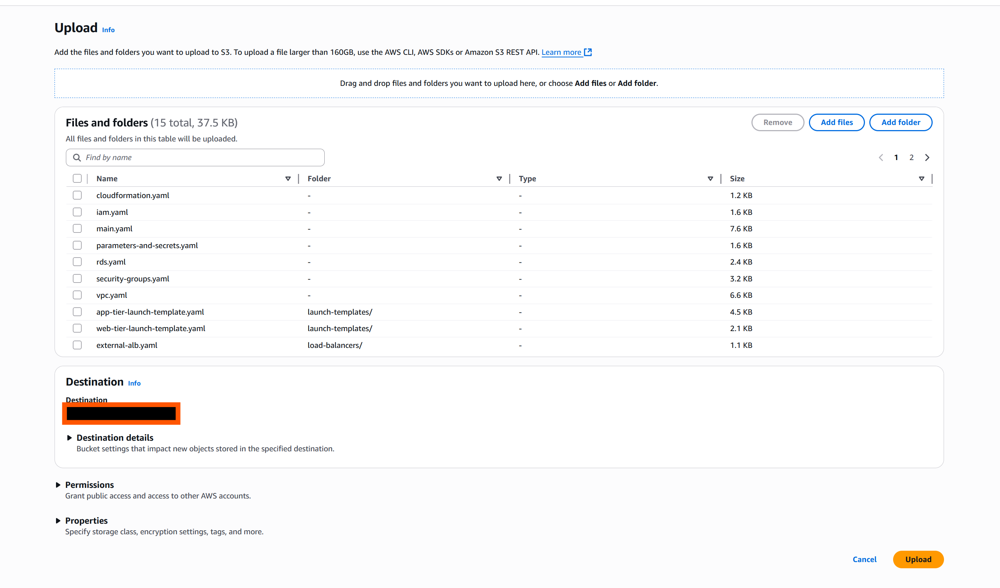

### 18: Add YAML File Links To main.YAML
*Connect all the templates together*

1. Open the web console.
2. Navigate to the S3 console.
3. Select your newly created bucket.
4. Select the corresponding YAML file.
5. Press *Copy URL* and then paste that into your main.yaml file in the template URL section. Repeat this for each URL.
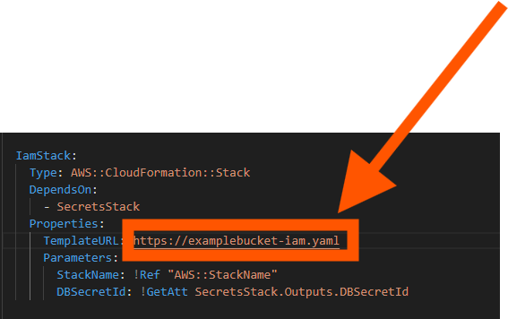
```YAML
AWSTemplateFormatVersion: '2010-09-09'
Description: Multi-Tier Public Private  stack with CIDR mPrivateings

Mappings:
  RegionToCidr:
    eu-west-2:
      VpcCidr: 10.16.0.0/16
      PublicSubnet1: 10.16.0.0/20
      PublicSubnet2: 10.16.16.0/20
      PublicSubnet3: 10.16.32.0/20
      PrivateSubnet1: 10.16.48.0/20
      PrivateSubnet2: 10.16.64.0/20
      PrivateSubnet3: 10.16.80.0/20
      
    us-east-1:
      VpcCidr: 10.32.0.0/16
      PublicSubnet1: 10.32.0.0/20
      PublicSubnet2: 10.32.16.0/20
      PublicSubnet3: 10.32.32.0/20
      PrivateSubnet1: 10.32.48.0/20
      PrivateSubnet2: 10.32.64.0/20
      PrivateSubnet3: 10.32.80.0/20

Resources:

  SecretsStack:
    Type: AWS::CloudFormation::Stack
    Properties:
      TemplateURL: <Enter Secrets stack URL>
      Parameters:
        StackName: !Ref "AWS::StackName"

  IamStack:
    Type: AWS::CloudFormation::Stack
    DependsOn:
      - SecretsStack
    Properties:
      TemplateURL: https://examplebucket-iam.yaml
      Parameters:
        StackName: !Ref "AWS::StackName"
        DBSecretId: !GetAtt SecretsStack.Outputs.DBSecretId
    
  VpcStack:
    Type: AWS::CloudFormation::Stack
    Properties:
      TemplateURL: <Enter VPC stack URL>
      Parameters:
        StackName: !Ref "AWS::StackName"
        VpcCidr: !FindInMap [RegionToCidr, !Ref "AWS::Region", VpcCidr]
        PublicSubnet1: !FindInMap [RegionToCidr, !Ref "AWS::Region", PublicSubnet1]
        PublicSubnet2: !FindInMap [RegionToCidr, !Ref "AWS::Region", PublicSubnet2]
        PrivateSubnet1: !FindInMap [RegionToCidr, !Ref "AWS::Region", PrivateSubnet1]
        PrivateSubnet2: !FindInMap [RegionToCidr, !Ref "AWS::Region", PrivateSubnet2]

  SecurityGroupsStack:
    Type: AWS::CloudFormation::Stack
    DependsOn: VpcStack
    Properties:
      TemplateURL: <Enter security Stack  URL>
      Parameters:
        StackName: !Ref "AWS::StackName"
        VpcId: !GetAtt VpcStack.Outputs.VpcId

  RDSStack:
    Type: AWS::CloudFormation::Stack
    DependsOn: 
      - SecurityGroupsStack
      - SecretsStack
      - VpcStack
    Properties:
      TemplateURL: <Enter RDS stack URL>
      Parameters:
        StackName: !Ref "AWS::StackName"
        VpcId: !GetAtt VpcStack.Outputs.VpcId
        PrivateSubnet1Id: !GetAtt VpcStack.Outputs.PrivateSubnet1Id
        PrivateSubnet2Id: !GetAtt VpcStack.Outputs.PrivateSubnet2Id
        RdsSgId: !GetAtt SecurityGroupsStack.Outputs.RdsSgId 
        DBSecretId: !GetAtt SecretsStack.Outputs.DBSecretId
        DBNameId: !GetAtt SecretsStack.Outputs.DBNameId
        DBEngineId: !GetAtt SecretsStack.Outputs.DBEngineId
        DBPortId: !GetAtt SecretsStack.Outputs.DBPortId
        
  AppLTStack:
    Type: AWS::CloudFormation::Stack
    DependsOn: 
      - SecretsStack
      - SecurityGroupsStack
      - IamStack
      - RDSStack
    Properties:
      TemplateURL: <Enter app launch template stack URL>
      Parameters:
        StackName: !Ref "AWS::StackName"
        Ec2AppSgId: !GetAtt SecurityGroupsStack.Outputs.Ec2AppSgId 
        DBSecretId: !GetAtt SecretsStack.Outputs.DBSecretId 
        EC2InstanceProfileId: !GetAtt IamStack.Outputs.EC2InstanceProfileId  
        DatabaseEndpointId: !GetAtt RDSStack.Outputs.DatabaseEndpointId     

  InternalAlbStack:
    Type: AWS::CloudFormation::Stack
    DependsOn: 
      - VpcStack
      - SecurityGroupsStack
    Properties:
        TemplateURL: <Enter internal ALB stack URL>
        Parameters:
          StackName: !Ref "AWS::StackName"
          PrivateSubnet1Id: !GetAtt VpcStack.Outputs.PrivateSubnet1Id
          PrivateSubnet2Id: !GetAtt VpcStack.Outputs.PrivateSubnet2Id
          Ec2InternalAlbSgId: !GetAtt SecurityGroupsStack.Outputs.Ec2InternalAlbSgId

  WebLTStack:
    Type: AWS::CloudFormation::Stack
    DependsOn: 
      - SecurityGroupsStack
      - IamStack
      - InternalAlbStack
    Properties:
      TemplateURL: <Enter web launch template stack URL>
      Parameters:
        StackName: !Ref "AWS::StackName"
        Ec2WebSgId: !GetAtt SecurityGroupsStack.Outputs.Ec2WebSgId
        EC2InstanceProfileId: !GetAtt IamStack.Outputs.EC2InstanceProfileId   
        InternalAlbDNS: !GetAtt InternalAlbStack.Outputs.InternalAlbDNS    
  
  InternalTGStack:
    Type: AWS::CloudFormation::Stack
    DependsOn:
      - InternalAlbStack
      - VpcStack
    Properties:
      TemplateURL: <Enter internal target group stack URL>
      Parameters:
        StackName: !Ref "AWS::StackName"
        VpcId: !GetAtt VpcStack.Outputs.VpcId
        InternalAlbId: !GetAtt InternalAlbStack.Outputs.InternalAlbId

  AppASGStack:
    Type: AWS::CloudFormation::Stack
    DependsOn: 
      - VpcStack
      - SecurityGroupsStack
      - InternalTGStack
      - AppLTStack
      - RDSStack
    Properties:
      TemplateURL: <Enter app autoscaling stack URL>
      Parameters:
        StackName: !Ref "AWS::StackName"
        AppLaunchTemplateId: !GetAtt AppLTStack.Outputs.AppTierLaunchTemplateId
        PrivateSubnet1Id: !GetAtt VpcStack.Outputs.PrivateSubnet1Id
        PrivateSubnet2Id: !GetAtt VpcStack.Outputs.PrivateSubnet2Id
        InternalTargetGroupId: !GetAtt InternalTGStack.Outputs.InternalTargetGroupId
        AppTierLaunchTemplateVersion: !GetAtt AppLTStack.Outputs.AppTierLaunchTemplateVersion

  ExternalAlbStack:
    Type: AWS::CloudFormation::Stack
    DependsOn:
      - VpcStack
      - SecurityGroupsStack
    Properties:
      TemplateURL: <Enter external ALB stack URL>l
      Parameters:
        StackName: !Ref "AWS::StackName"
        VpcId: !GetAtt VpcStack.Outputs.VpcId
        PublicSubnet1Id: !GetAtt VpcStack.Outputs.PublicSubnet1Id
        PublicSubnet2Id: !GetAtt VpcStack.Outputs.PublicSubnet2Id
        Ec2ExternalAlbSgId: !GetAtt SecurityGroupsStack.Outputs.Ec2ExternalAlbSgId

  ExternalTGStack:
    Type: AWS::CloudFormation::Stack
    DependsOn:
      - ExternalAlbStack
      - VpcStack
    Properties:
      TemplateURL: <Enter l targeT Group stack URL>
      Parameters:
        StackName: !Ref "AWS::StackName"
        VpcId: !GetAtt VpcStack.Outputs.VpcId
        ExternalAlbId: !GetAtt ExternalAlbStack.Outputs.ExternalAlbId

  WebASGStack:
    Type: AWS::CloudFormation::Stack
    DependsOn: 
      - VpcStack
      - SecurityGroupsStack
      - ExternalTGStack
      - WebLTStack
    Properties:
      TemplateURL: <Enter Web autoscaling group stack URL>
      Parameters:
        StackName: !Ref "AWS::StackName"
        WebLaunchTemplateId: !GetAtt WebLTStack.Outputs.WebTierLaunchTemplateId
        PublicSubnet1Id: !GetAtt VpcStack.Outputs.PublicSubnet1Id
        PublicSubnet2Id: !GetAtt VpcStack.Outputs.PublicSubnet2Id
        ExternalTargetGroupId: !GetAtt ExternalTGStack.Outputs.ExternalTargetGroupId
        WebTierLaunchTemplateVersion: !GetAtt WebLTStack.Outputs.WebTierLaunchTemplateVersion  
```

### Step 19: Launch CloudFormation Template
*Launch the execution role for the stack*

1. Navigate to the CloudFormation console.
2. Select Stacks.
3. Press *Create stack*.
4. Copy and paste the S3 URL for the CloudFormation role stack.
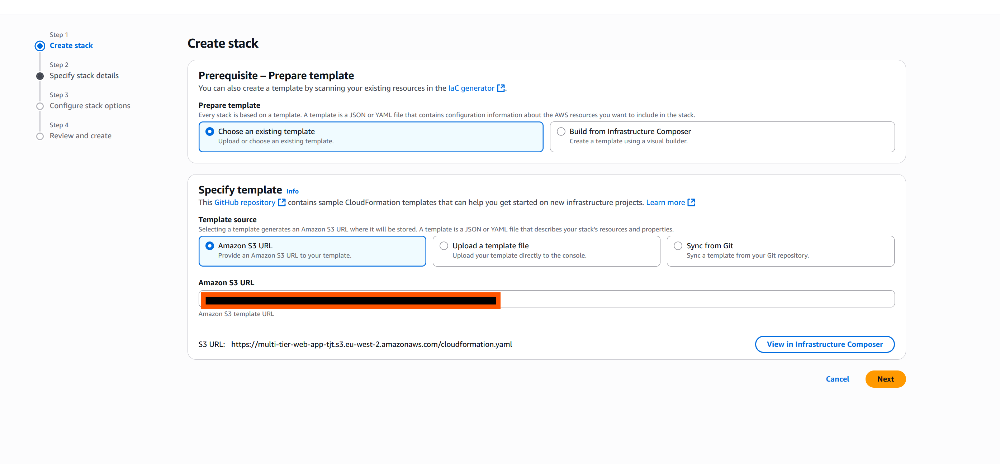
5. Name your stack.
6. Ensure you are launching this with a role that has permissions to create the stack.
7. Click the acknowledgement.
8. Press *next*.
9. Press *Submit*

### Step 20: Launch The main.yaml Template
*Launch the full project*

1. Navigate to the CloudFormation console.
2. Select Stacks.
3. Press *Create stack*.
4. Copy and paste the S3 URL for the main.yaml stack. 
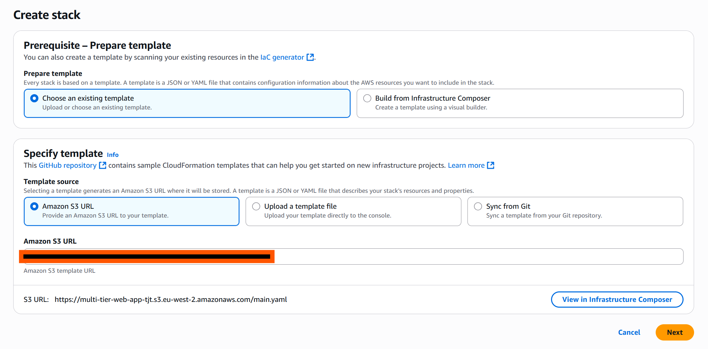
5. Name your stack.
6. Press the refresh button.
7. Select your newly created CloudFormation role.
8. Select preserve successfully provisoned resources.
9. Accept the acknowledgements.
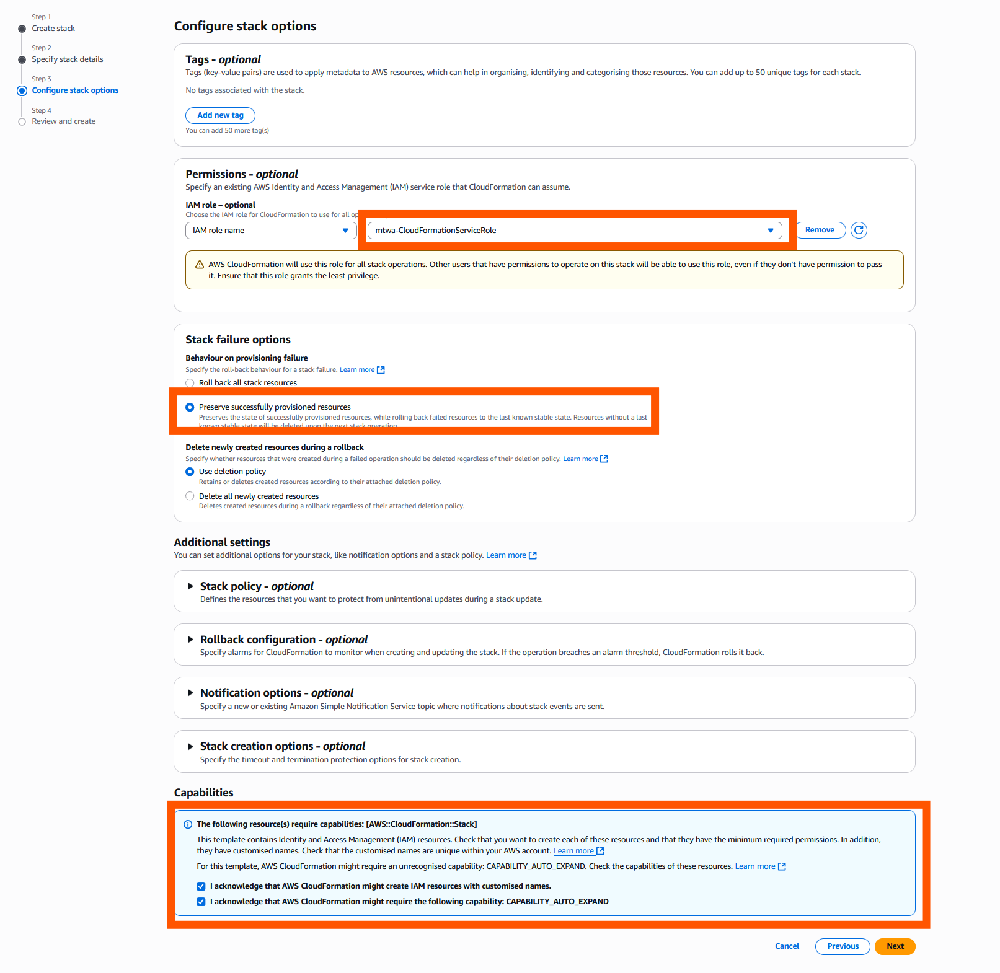
10. Press *Next*.
11. Press *Submit*


### Step 21: Verify Launch:

1. Check CloudFormation Launch status
  - Click on the CloudFormation Console.
  - Select the stack.
  - Select events.
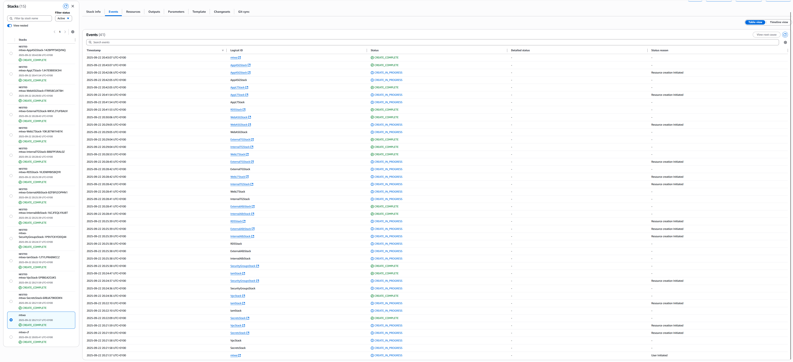

2. Verify Connectivity from web tier.
  - Connect to the external load balancers DNS.
  - Select EC2.
  - Select Load balancers.
  - Select the external load balancer
  - Copy the DNS name and paste it in your browser.
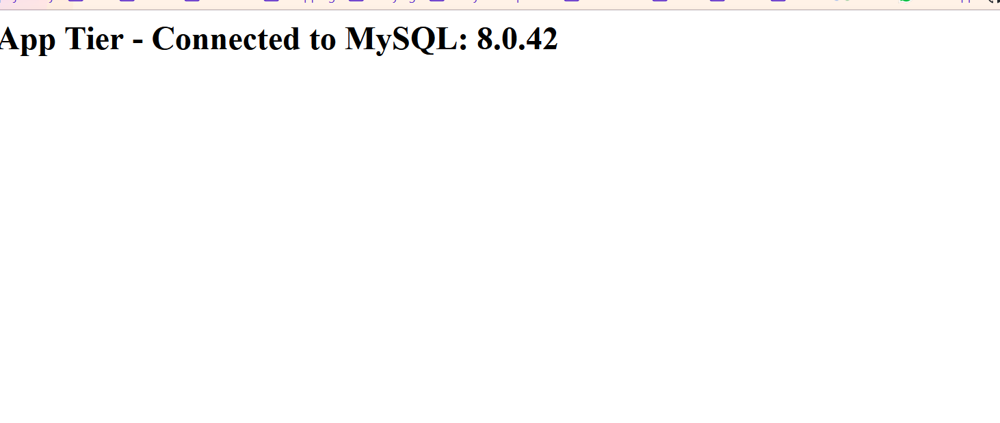 

3. Verify Connectivity to the database
  - Connect to the App tier instance.
  - Select EC2.
  - Select the app tier instance.
  - Select *Connect*.
  - Select session manager.
  - Enter:
```bash
bash
mysql -h <database DNS> -u <database username> -p`
```
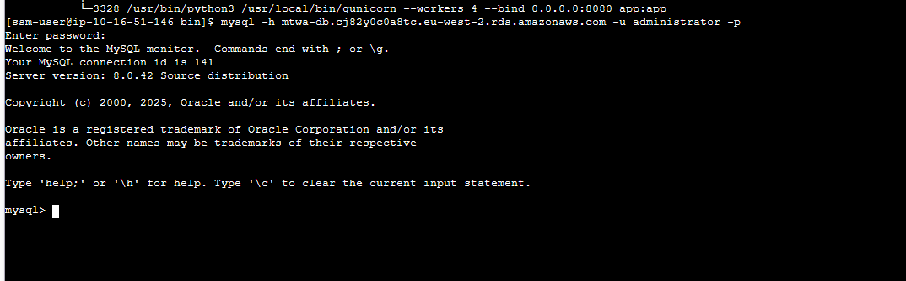

4. Confirm Target Groups Are Healthy.
  - Select EC2.
  - Select Target Groups.
  - Select both target groups one at a time and check all instances are healthy.
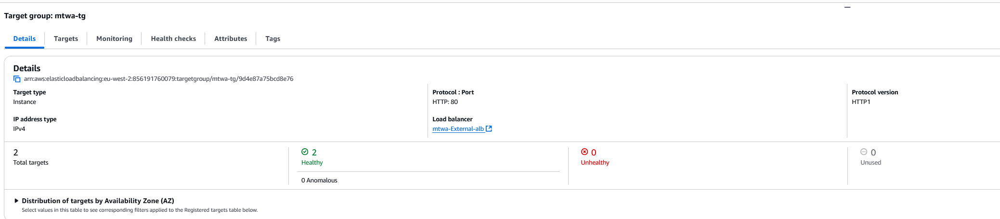

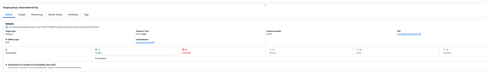

